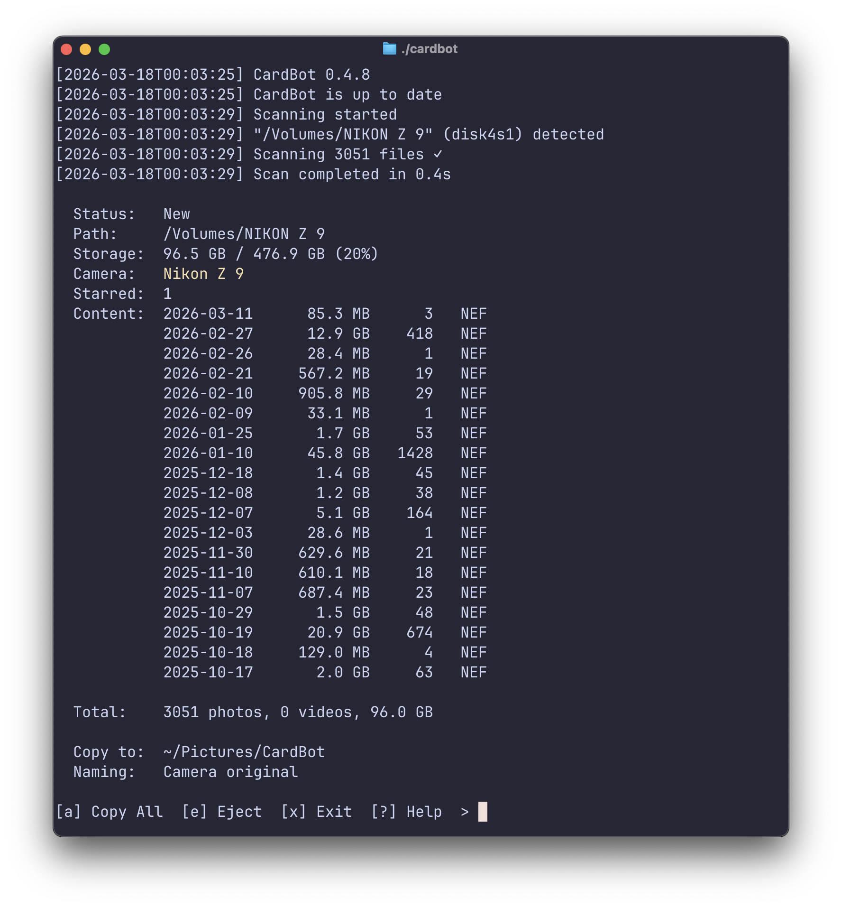

# CardBot

A CLI tool for camera memory cards.



## What it does

- Detects camera memory cards on macOS
- Analyzes card content (file count, type, dates, equiptment data)
- Copies media files quickly and safely. Time is money. Safety is life.
- Generates dated folder structures for local copy location
- Supports quick copy modes: all, selects (starred), photos only, videos only, etc.

## Platform status

| Platform | Status | Notes |
|----------|--------|-------|
| macOS | Supported | Primary platform |
| Linux | It might work | Untested |
| Windows | Ugh | Someday, Maybe |

## Installation

One-liner installer:

```bash
curl -fsSL https://raw.githubusercontent.com/willduncanphoto/CardBot/main/install.sh | sh
```

## Usage

Start interactive mode:

```bash
cardbot
```

CardBot will automatically run the setup if it hasn't been run before. 

Run setup again (dest, naming prefs, startup and auto-detect prefs):

```bash
cardbot --setup
```

## CLI flags

| Flag | Description |
|------|-------------|
| `--dest <path>` | Override destination path for this run |
| `--dry-run` | Analyze only; do not copy |
| `--daemon` | Run headless background watcher |
| `--setup` | Re-run setup prompts |
| `--reset` | Clear saved config |
| `--version` | Print version |

## Interactive commands

| Key | Action |
|-----|--------|
| `a` | Copy all |
| `s` | Copy selects (starred/picked) |
| `p` | Copy photos |
| `v` | Copy videos |
| `e` | Eject card |
| `x` | Exit current card |
| `i` | Show card hardware info |
| `t` | Run speed test |
| `\` | Cancel active copy |
| `?` | Help |

## Roadmap

| Version | Focus | Status |
|---------|-------|--------|
| **0.5.2** | Launcher diagnostics + uninstall workflow | Current |
| **0.6.0** | General improvements | Next |
| **0.7.0** | Homebrew support | Planned |
| **0.8.0** | Copyright check | Planned |

## License

MIT — see [LICENSE](LICENSE).
